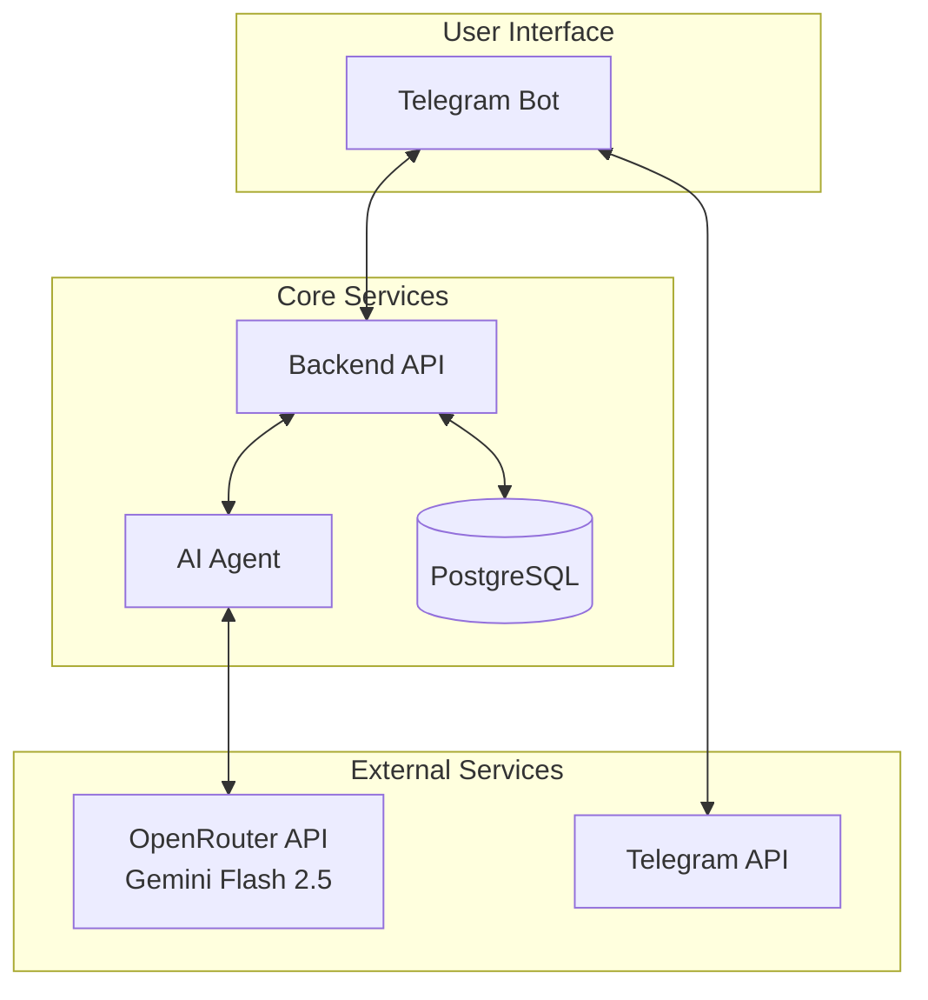

# MemeXpert

An intelligent meme management system that automatically generates Russian-language tags for memes using AI and provides powerful search capabilities through a Telegram bot interface.

## 🎯 Overview

MemeXpert is a microservices-based system that allows users to:

- Send photos to a Telegram bot and receive AI-generated Russian tags
- Search and share memes using inline queries in any Telegram chat
- Automatically store and organize memes with intelligent tagging

The system leverages advanced computer vision and natural language processing to understand meme content and generate contextually relevant Russian tags.

## 🚀 Quick Start

### Prerequisites

- Podman or Docker
- Telegram Bot Token from [@BotFather](https://t.me/BotFather)
- OpenRouter API key

### 1. Download Template

```bash
# Create directory for deployment
mkdir memexpert
cd memexpert

# Download template
curl https://raw.githubusercontent.com/averyanalex/memexpert/refs/heads/main/docker-compose.yml -o docker-compose.yml
curl https://raw.githubusercontent.com/averyanalex/memexpert/refs/heads/main/.env.example -o .env
```

### 2. Setup .env

Edit .env with your API keys:

- OPENROUTER_API_KEY=your-openrouter-api-key
- TELEGRAM_BOT_TOKEN=your-telegram-bot-token

### 3. Start with Docker Compose

```bash
# Download all required images (if you want to use pre-built images)
docker compose pull

# Or build the images yourself (you need to clone the full repository to do this)
docker compose build

# Start all services
docker compose up -d

# Check status
docker compose ps

# View logs
docker compose logs -f
```

### 4. Use the Telegram Bot

1. Find your bot on Telegram
2. Send `/start` to get started
3. Send any photo to generate AI tags and save it
4. Use inline search: `@yourbotname кот` to find memes

## 🏗️ System Architecture



### Components

1. **🤖 Telegram Bot** (`clients/telegram/`)
   - User interface via Telegram
   - Photo processing and tag display
   - Inline search functionality
   - Built with Aiogram 3.21+

2. **🚀 Backend API** (`backend/`)
   - RESTful API for meme management
   - PostgreSQL database integration
   - Coordinates between bot and AI agent
   - Built with FastAPI + SQLModel

3. **🧠 AI Agent** (`agent/`)
   - AI-powered tag generation service
   - Image processing and optimization
   - Uses Google Gemini Flash 2.5 (via OpenRouter)
   - Built with FastAPI + Pydantic-AI

4. **🗄️ Database**
   - PostgreSQL for persistent storage
   - Stores memes, tags, and relationships
   - Optimized for search operations

## 📚 Service Details

### 🤖 Telegram Bot

**Features:**

- AI-powered meme creation with Russian tags
- Inline search across stored memes
- Real-time photo processing
- Clean Russian interface

**Usage:**

- Send photos → Get AI-generated tags
- Inline queries → Search and share memes
- Commands: `/start`

### 🚀 Backend API

**Features:**

- RESTful meme management API
- PostgreSQL with optimized search
- Automatic AI tag integration
- Async architecture for performance

**Key Endpoints:**

- `POST /memes` - Create meme with AI tags
- `GET /memes?text=query` - Search memes
- `GET /docs` - API documentation

### 🧠 AI Agent

**Features:**

- Google Gemini Flash 2.5 integration
- Context-aware tag generation
- Image optimization (max 512px)
- Russian-language specialization

**Key Endpoints:**

- `POST /generate/tags` - Generate tags for images
- `GET /docs` - API documentation

## 🌊 User Flow

### Meme Creation

```text
User sends photo → Telegram Bot → Backend API → AI Agent → OpenRouter
↓
Tags generated ← Telegram Bot ← Backend API ← AI Agent ← OpenRouter
```

### Meme Search

```text
User inline query → Telegram Bot → Backend API → PostgreSQL
↓
Results shown ← Telegram Bot ← Backend API ← PostgreSQL
```

## 🔍 Key Features

### AI-Powered Tagging

- **Advanced Vision**: Uses Google Gemini Flash 2.5 for image understanding
- **Russian Specialization**: Generates 10-20 Russian, lowercase, concise tags
- **Context Awareness**: Considers existing tags for consistency
- **Image Optimization**: Automatic resize and format conversion

### Smart Search

- **Full-text Search**: Search across all tag names
- **Case-insensitive**: Flexible matching with ILIKE
- **Inline Integration**: Search directly in Telegram chats
- **Fast Results**: Optimized database queries

### Clean Architecture

- **Microservices**: Loosely coupled, independently deployable
- **Dependency Injection**: Dishka containers for testability
- **Type Safety**: Full type hints with Pydantic validation
- **Observability**: OpenTelemetry integration throughout

## 🛠️ Tech Stack

- **Languages**: Python 3.13+
- **Frameworks**: FastAPI, Aiogram 3.21+
- **AI**: Pydantic-AI + OpenRouter + Google Gemini
- **Database**: PostgreSQL 17 + SQLModel
- **Architecture**: Dishka DI containers
- **Tools**: uv, Alembic, Docker
- **Observability**: OpenTelemetry

## 📈 Scaling

The microservices architecture allows for:

- **Horizontal Scaling**: Each service can scale independently
- **Load Distribution**: Backend handles multiple bot instances
- **Database Optimization**: PostgreSQL with proper indexing
